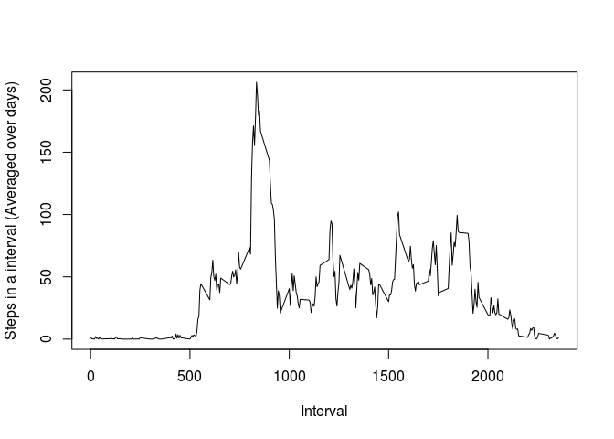
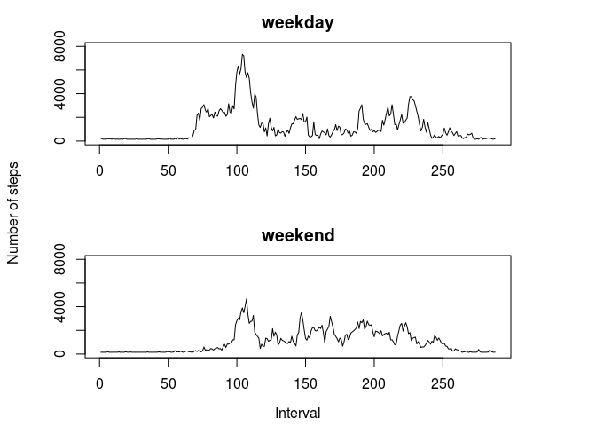

# Peer assessment1_Repdata-032
Ganesh Birajdar  
September 14, 2015  

Following is the r code to load the data necessary for analysis asked for in
question of peer assessment 1 of the course repdata-032 on coursera. It assumes 
that there is a file named 'activity.csv' in your working
directory, which is in following github repository in 'activity.zip' file:
http://github.com/rdpeng/RepData_PeerAssessment1
We will first read the given dataset and then answer the 4 question asked one by
one, which are:  
**_1. What is mean total number of steps taken per day?_**  
**_2. What is the average daily activity pattern?_**  
**_3. Imputing missing values_**  
**_4. Are there differences in activity patterns between weekdays and weekends?_**  


```r
activity <- read.csv("activity.csv")
```

Now that we have loaded the data into workspace, we will remove NAs in order to
make it is for us to perform operations like 'sum' or 'mean' on this data. Also 
following code will change the class of date variable in dataset to date format
using as.Date function.
Before that it is useful to check how our data looks like, using functions like
str() or head().

```r
activity_noNAs <- na.omit(activity)
activity_noNAs$date <- as.Date(activity_noNAs$date)
```

Now our dataset is ready to perform some analysis. Starting with first question:  

**_1. What is mean total number of steps taken per day?_**  

First of all, we will calculate **the number of steps taken per day**. We don't 
want to see it's output, but rather want to see the histogram created with this 
output, therefore we will specify results="hide" in following code which tells 
it to print only the code and not the output.

```r
stepsbyday <- sapply(split(activity_noNAs$steps, activity_noNAs$date), sum)
```

We will now plot this daily count to a histogram which will allow us how it is
distributed.

```r
hist(stepsbyday, 
     xlab = "Number of steps in a day", ylab = "Frequency (Number of days)",
     main = "Total number steps taken per day")
```

 

```r
print(meansteps <- mean(stepsbyday))
```

```
## [1] 10766.19
```

```r
print(mediansteps <- median(stepsbyday))
```

```
## [1] 10765
```

So we see that the mean steps taken in a day were 10766.15 and median were
10765.  
Now coming to our second question:  

**_2. What is the average daily activity pattern?_**  

For this, first we will creat average out number of steps taken in each time
interval averaged over all days (e.g., number of steps taken in time 
interval 5, everyday)

```r
stepsmeanbyinterval <- sapply(split(activity_noNAs$steps, 
                                    activity_noNAs$interval), mean)
```

Now when we plot it and look at the 5 minute interval with most number of steps,
we see that it is the interval number 835.

```r
plot(names(stepsmeanbyinterval), stepsmeanbyinterval, type = "l", 
     xlab = "Interval", ylab = "Steps in a interval (Averaged over days)")
```

 

```r
maxval <- which.max(stepsmeanbyinterval)
print(maxinterval <- as.numeric(names(maxval)))
```

```
## [1] 835
```

**Third problem:**  
**_3. Imputing missing values_**  

First we will count the number of rows with missing values.

```r
print(NAcount <- sum(is.na(activity$steps)))
```

```
## [1] 2304
```

We can see that there are 2304 missing values.   
Now we want to fill up those missing values to avoid the bias in our analysis.  
For that we will fill up the NA places in 'activity$steps' with the average
number of steps in an interval, everaged over all intervals.  

```r
meansteps <- mean(activity$steps, na.rm = TRUE)
activity_imputed <- activity
for (i in 1:nrow(activity_imputed)){
        if(is.na(activity_imputed$steps[i]))
                activity_imputed$steps[i] <- meansteps
}
```

Now that we have filled up the missing values, we will calculate the total
number of steps taken each day, as well as mean and median of these total number
of steps each day. It will be same as we had done to adress our first question
but with the NA values filled in.

```r
stepsbyday_actimp <- sapply(split(activity_imputed$steps, activity_imputed$date), sum)
```
We will now plot this daily count to a histogram which will allow us how it is
distributed.

```r
hist(stepsbyday_actimp, 
     xlab = "Number of steps in a day", ylab = "Frequency (Number of days)",
     main = "Total number steps taken per day")
```

 

```r
print(meansteps <- mean(stepsbyday_actimp))
```

```
## [1] 10766.19
```

```r
print(mediansteps <- median(stepsbyday_actimp))
```

```
## [1] 10766.19
```
  
As we see, there is not impact of imputing values on mean of the total number of
the steps per day, but the median value is changed to be equal to the mean.  

Now to address our last question:  

**_4. Are there differences in activity patterns between weekdays and weekends?_**  

we will first create a factor variable with two levels, "weekday and weeked" and
add it to our imputed data set.

```r
daysofweek <- weekdays(as.Date(activity_imputed$date))
timeofweek <- character()
        for (i in 1:length(daysofweek)){
                if (daysofweek[i]=="Friday" | daysofweek[i]==
                    "Saturday" | daysofweek[i]=="Sunday")
                        timeofweek[i] <- "weekend"
                else timeofweek[i] <- "weekday"
        }
timeofweek <- as.factor(timeofweek)
activity_imputed[,4] <- timeofweek
```

Now as we want to creat two different plots of average steps over weekdays and
weekends, we will first split data set into weeddays and weekends, and then
average it over days.  

```r
weektimedata <- split(activity_imputed, activity_imputed$V4)
stepsbyweekdayintervals <- sapply(split(weektimedata$weekday$steps, 
                                        weektimedata$weekday$interval), sum)
stepsbyweekendintervals <- sapply(split(weektimedata$weekend$steps, 
                                        weektimedata$weekend$interval), sum)
```
  
Plotting this data will give us comparative view of average steps in an interval
averaged over weekdays and weekends

```r
par(mfrow=c(2,1), mai=c(0.8, 1, 0.5, 1))
plot(stepsbyweekdayintervals, ylim=c(0,8000), type = "l", main = "weekday", 
                                                xlab = "", ylab = "")
plot(stepsbyweekendintervals, ylim=c(0,8000), type = "l", main = "weekend", 
                                                xlab = "", ylab = "")
mtext("Interval", side=1, padj = -2, outer = TRUE)
mtext("Number of steps", side = 2, padj = 2, outer = TRUE)
```

 

```r
dev.off()
```

```
## null device 
##           1
```
  
Looking at these plots we can see that number of steps in each interval are
slightly more on weekdays as compared to weekends. Let's check it looking at 
seperate mean for weekends and weekdays, averaged over days.


```
## [1] "Mean steps in an interval on weekdays: "
```

```
## [1] 1227.301
```

```
## [1] "Mean steps in an interval on weekends: "
```

```
## [1] 1053.037
```

As we guessed the mean for steps per interval is indeed more for weedays than for
weekends.  
**This concludes all questions in assignment. Hope that all answers are clear.**  
**Thanks for patiently going through the whole document.**

